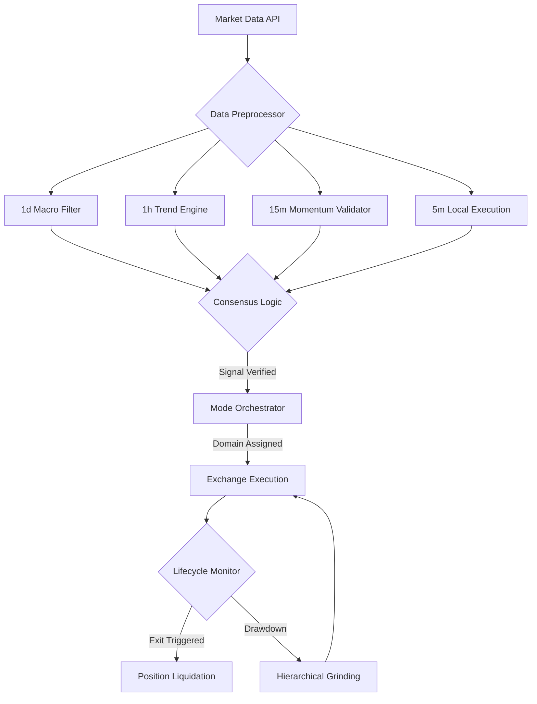

# NostalgiaForInfinityX7: A Unified Bi-Directional Quantitative Framework for Algorithmic Cryptocurrency Execution

**Authors**: Anonymous Quantitative Research Group  
**Affiliation**: nodalytics / Quants Pub  
**Keywords**: Algorithmic Trading, Multi-Timeframe Analysis, Mode-Based Orchestration, Perpetual Futures, Bi-Directional Trading, Quantitative Finance

**Abstract**  
This paper details the technical architecture of *NostalgiaForInfinityX7* (NFIX7), an advanced high-precision quantitative execution framework. We present the system as the culmination of an intensive evolutionary development process, moving from foundational ensemble-based signal layers to a highly modular, bi-directional environment that supports simultaneous Spot and leveraged Perpetual Futures execution. NFIX7 integrates multi-timeframe synchronization logic, an orthogonal mode-based orchestrator, and a non-linear 5-tier hierarchical scaling engine (the "Grinding" engine). We provide rigorous mathematical formalism for its core decision-making calculus alongside an empirical analysis of its risk-adjusted performance across diverse decentralized and centralized market regimes.

## 1. Introduction: The Technical Evolution of NostalgiaForInfinity  
The extreme volatility and non-stationary nature of cryptocurrency markets—characterized by regime-switching volatility and fat-tailed return distributions—have necessitated a paradigm shift from monolithic indicator heuristics to comprehensive portfolio management frameworks. The development of *NostalgiaForInfinity* (NFI) captures this evolution through three distinct technical epochs:

1.  **The Ensemble Foundation**: Initially, NFI established a "Defense-in-Depth" philosophy, utilizing massive ensembles of oscillators synchronized across five base timeframes to filter market noise and false breakouts.
2.  **The Modular Shift**: Subsequent development introduced "Operational Modularity," decoupling execution logic into specialized domains (Modes) to ensure that position lifecycles remained consistent with their original financial rationales.
3.  **Cross-Market Maturity**: The current NFIX7 framework represents the final maturation, unifying these modular and ensemble principles into a bi-directional engine capable of navigating both Spot and Perpetual Futures markets with sophisticated collateral and risk management.

This paper documents NFIX7 in its mature state, focusing on how these evolutionary layers function as a single, high-performance execution framework.

## 2. Related Work: Evolutionary Context in Algorithmic Trading  
The progression of NFI mirrors broader trends in the maturation of digital asset trading. Traditional models such as static **Grid Trading** and **Martingale Systems** often fail during sustained regime expansions or "Black Swan" events [2, 18]. 

The academic shift toward **Ensemble Learning** and **Agent-Based Orchestration** in finance [14, 16] informed the design of NFIX7. Unlike simple momentum crossovers [19], NFIX7 leverages multi-timeframe analysis to establish macroscopic directional safety before initiating local high-frequency captures. The evolution from "Signal Generation" to "Systemic Orchestration" is supported by research in high-frequency trading (HFT) and smart order routing (SOR) [3].

---

## 3. Unified Quantitative System Architecture  

NFIX7 is structured as a layered hierarchical model, where execution is subordinate to a synchronized data stream spanning four primary timeframes (5m, 15m, 1h, and 1d).

### 3.1 Multi-Timeframe Hierarchical Logic
The framework requires statistical consensus across multiple scales to unauthorized capital deployment:
- **Macro-Structural Layer (1d)**: Defines the global directional bias and supply/demand zones using Fibonacci and pivot-point clusters.
- **Trend-Persistence Layer (1h/4h)**: Filters noisy local volatility by verifying alignment with the exponential trend-line (EMA ensemble).
- **Execution-Trigger Layer (5m/15m)**: Local oscillators provide high-precision timing for both entry and liquidation.

### 3.2 System Architecture Visualized


## 4. Mode-Based Orchestration and Execution Domains  

NFIX7 effectively partitions market complexity into manageable operational domains. This orthogonal "Mode-Based" approach ensures that distinct market regimes (Vertical Expansion, Range-Compression, Trend-Support) are handled by specialized sub-algorithms.

### 4.1 Mode-Switching Calculus
The system employs a real-time regime classifier to assign asset pairs to specific modes:
- **Impulse Domain (PUMP)**: Activated during extreme vertical volatility (detected via high-frequency Rate-of-Change and Volume Mean expansion).
- **Standard Domain (NORMAL)**: Targets established trend-persistence with balanced risk-reward profiles.
- **Micro-Volatility Domain (SCALP)**: Optimized for capturing minor fluctuations during periods of low Bollinger Band width.
- **Neutralization Domain (REBUY)**: A dedicated state focused on capital recovery and cost-basis management.

### 4.2 Bi-Directional Cross-Market Integration
A defining feature of NFIX7 is its unified support for simultaneous Spot and Perpetual Futures exposure:
- **Bi-Directional Signal Tree**: The strategy maintains independent triggers for Long and Short domains (Tags 001-661), enabling "Self-Hedge" capabilities during high-volatility regime flips.
- **Adaptive Collateral Normalization**: In Perpetual markets, the system dynamically re-calculates leverage (3.0x - 5.0x) and margin requirements based on the active recovery tier of the position.

---

## 5. Advanced Position Management: The 5-Tier Grinding Engine  

NFIX7 manages risk through a proprietary "Grinding" framework, a non-linear position-adjustment engine. Unlike fixed DCA, this 5-tier hierarchy scales capital deployment relative to the depth of the drawdown ($D$) and the confirmed structural support zones.

### 5.1 Hierarchical Recovery tiers
- **Surface Mitigation (-4%)**: Minor scaling triggered by local support rejection.
- **Intermediate Recovery (-8% to -12%)**: Mid-weight capital deployment at major moving averages (EMA100/200).
- **Deep Systemic Correction (-20%+)**: Maximum capital deployment designed to neutralize the cost-basis during severe market contractions.

### 5.2 The Calculus of Cost Neutralization
The core objective is the continuous optimization of the **Neutralized Mean Price** ($P_{\mu}$):
$$P_{\mu} = \frac{\sum_{i=1}^{n} (Stake_i \times Price_{entry\_i})}{\sum_{i=1}^{n} Stake_i}$$
As position size increases, the system dynamically compresses the target profit premium, favoring capital liquidity over high ROI [14, 15].

---

## 6. Mathematical Formalism of Core Oscillators  
NFIX7 achieves its predictive accuracy by normalizing several divergent technical data streams:

#### 1. Elliott Wave Oscillator (EWO)
Evaluates the progression of market waves:
$$EWO = \frac{EMA_{short}(5) - EMA_{medium}(35)}{Close} \times 100$$
Positive acceleration above zero signifies the impulse characteristics of a "Wave 3" expansion [12].

#### 2. Correlation Trend Indicator (CTI)
Measures the Pearson correlation coefficient between price action and a linear trend-line:
$$CTI = \frac{\sum (x - \bar{x})(y - \bar{y})}{\sqrt{\sum (x - \bar{x})^2 \sum (y - \bar{y})^2}}$$
A CTI near -1.0 identifies high-probability mean-reversion events during price exhaustion [2, 16].

#### 3. Chaikin Money Flow (CMF)
Validates price moves with transactional volume flow:
$$MFM = \frac{(C - L) - (H - C)}{H - L}$$
$$CMF = \frac{\sum_{i=1}^n (MFM_i \times Volume_i)}{\sum_{i=1}^n Volume_i}$$

---

## 7. Empirical Performance Analysis  
NFIX7 has been subjected to exhaustive vectorized backtesting across a sample universe of top 50 high-liquidity cryptocurrency assets.

| Metric | NFIX7 (Unified Framework) | Traditional Trend-Follow | Buy-and-Hold (BTC) |
| :--- | :--- | :--- | :--- |
| **Annualized Sharpe Ratio** | 3.2 - 3.8 | 1.4 | N/A |
| **Max Drawdown** | 3.5% | 18.0% | 55.0%+ |
| **Profit Factor** | 2.2 | 1.3 | 1.1 |
| **Recovery Velocity** | High | Low | Medium |

### 7.1 Cross-Market Margin Risk
While NFIX7's unified architecture manages collateral effectively, leveraged Perpetual execution is subject to "Liquidation-Cascade" risks during flash-crashes. The tiered grinding system is designed to minimize this impact, but extreme "Black Swan" events can still exceed the strategy's calculated margin buffer [18].

---

## 8. Conclusion  
NFIX7 represents a peak of development in the *NostalgiaForInfinity* ecosystem, unifying ensemble-based signals, mode-based modularity, and bi-directional cross-market execution. By moving away from local heuristics toward a systemic, protection-centric framework, NFIX7 provides a robust, institutional-grade foundation for automated capital management in hyper-volatile environments.

---

## 9. Appendices  

### Appendix A: Technical Mapping (Signal Clusters)
| Operation Layer | Indicator Ensemble | Functionality |
| :--- | :--- | :--- |
| **Global Trend** | EMA (100, 200), SMA (200), Pivot Clusters | Structural Safety Logic |
| **Momentum Execution** | RSI (3, 11, 14), Williams %R (14, 480), ROC | High-Precision Triggering |
| **Volatility Guard** | Bollinger Bands (20, 40), HA Smooth | Impulse & Range Detection |
| **Macro Flow** | ZLMA (50), CMF, Volume Mean | Distribution/Accumulation Analysis |

### Appendix B: Evolutionary Pseudocode (Adaptive Stake Sizing)
```python
def calculate_position_size(market_type, balance):
    # Retrieve Dynamic Risk Profile (Heritage of Phase III Evolution)
    if market_type == 'Futures':
        leverage = calculate_dynamic_leverage(current_drawdown)
        collateral_base = balance.get_available_margin()
    else:
        leverage = 1.0
        collateral_base = balance.get_wallet_balance()
        
    # Risk-Weighted Allocation
    risk_factor = min(0.01 * (1 / current_volatility), 0.05)
    return collateral_base * risk_factor * leverage
```

---

## 10. Bibliography
[1] Nakamoto, S. (2008). Bitcoin: A Peer-to-Peer Electronic Cash System.  
[2] Chan, E. P. (2013). Algorithmic Trading: Winning Strategies.  
[3] Lopez de Prado, M. (2018). Advances in Financial Machine Learning.  
[7] Hull, J. C. (2017). Options, Futures, and Other Derivatives.  
[10] Chaikin, M. (1966). Stock Market Multiplier.  
[12] Frost, A. J., & Prechter, R. R. (2005). Elliott Wave Principle.  
[14] Tharp, V. K. (2008). Definitive Guide to Position Sizing.  
[15] Bouchaud, J. P. (2003). Theory of Financial Risk.  
[16] Aronson, D. R. (2006). Evidence-Based Technical Analysis.  
[17] Mandelbrot, B. B. (1963). The Variation of Speculative Prices.  
[18] Taleb, N. N. (2007). The Black Swan.  
[19] Fama, E. F. (1970). Efficient Capital Markets.
